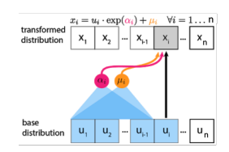

We continue our study over another type of likelihood based generative models. As before, we assume we are given access to a dataset $$\mathcal{D}$$ of $$n$$-dimensional datapoints $$\mathbf{x}$$. So far we have learned two types of likelihood based generative models: 

1. Autoregressive Models: $$p_\theta(\mathbf{x}) = \prod_{i=1}^{N} p_\theta(x_i \vert \mathbf{x}_{<i})$$

2. Variational autoencoders: $$p_\theta(\mathbf{x}) = \int p_\theta(\mathbf{x}, \mathbf{z}) \text{d}\mathbf{z}$$

The two methods have relative strengths and weaknesses. Autoregressive models provide tractable likelihoods but no direct mechanism for learning features, whereas variational autoencoders can learn feature representations but have intractable marginal likelihoods.

In this section, we introduce normalizing flows: a type of method that combines the best of both worlds, allowing both feature learning and tractable marginal likelihood estimation.

# Change of Variables Formula

In normalizing flows, we wish to map simple distributions (easy to sample and evaluate densities) to complex ones (learned via data). The change of variables formula describe how to evaluate densities of a random variable that is a deterministic transformation from another variable.

**Change of Variables**: $$Z$$ and $$X$$ be random variables which are related by a mapping $$f: \mathbb{R}^n \to \mathbb{R}^n$$ such that $$X = f(Z)$$ and $$Z = f^{-1}(X)$$. Then 

p_X(\mathbb{x}) = p_Z(f^{-1}(\mathbb{x})) \left\vert \text{det}\left(\frac{\partial f^{-1}(\mathbb{x})}{\partial \mathbb{x}}\right) \right\vert



There are several things to note here.

1. $$\mathbb{x}$$ and $$\mathbb{z}$$ need to be continuous and have the same dimension.

2. $$\frac{\partial f^{-1}(\mathbb{x})}{\partial \mathbb{x}}$$ is a matrix of dimension $$n \times n$$, where each entry at location $$(i, j)$$ is defined as $$\frac{\partial f^{-1}(\mathbb{x})_i}{\partial x_j}$$. This matrix is also known as the Jacobian matrix.

3. $$\text{det}(A)$$ denotes the determinant of a square matrix $$A$$.

4. For any invertible matrix $$A$$, $$\text{det}(A^{-1}) = \text{det}(A)^{-1}$$, so for $$\mathbb{z} = f^{-1}(\mathbb{x})$$ we have

   

   p_X(\mathbb{x}) = p_Z(\mathbb{z}) \left\vert \text{det}\left(\frac{\partial f(\mathbb{z})}{\partial \mathbb{z}}\right) \right\vert^{-1}

   

5. If $$\left \vert \text{det}\left(\frac{\partial f(\mathbb{z})}{\partial \mathbb{z}}\right) \right\vert = 1$$, then the mappings is volume preserving, which means that the transformed distribution $$p_X$$ will have the same “volume” compared to the original one $$p_Z$$. 

# Normalizing Flow Models

We are ready to introduce normalizing flow models. Let us consider a directed, latent-variable model over observed variables $$X$$ and latent variables $$Z$$. In a **normalizing flow model**, the mapping between $$Z$$ and $$X$$, given by $$f_\theta: \mathbb{R}^n \to \mathbb{R}^n$$, is deterministic and invertible such that $$X = f_\theta(Z)$$ and $$Z  = f_\theta^{-1}(X)$$[^nf]. 

Using change of variables, the marginal likelihood $$p(x)$$ is given by



p_X(\mathbb{x}; \theta) = p_Z(f_\theta^{-1}(\mathbb{x})) \left\vert \text{det}\left(\frac{\partial f^{-1}_\theta(\mathbb{x})}{\partial \mathbb{x}}\right) \right\vert



The name “normalizing flow” can be interpreted as the following:

1. “Normalizing” means that the change of variables gives a normalized density after applying an invertible transformation.
2. “Flow” means that the invertible transformations can be composed with each other to create more complex invertible transformations.

Different from autoregressive model and variational autoencoders, deep normalizing flow models require specific architectural structures. 

1. The input and output dimensions must be the same.
2. The transformation must be invertible.
3. Computing the determinant of the Jacobian needs to be efficient (and differentiable).

Next, we introduce several popular forms of flow models that satisfy these properties.

The Planar Flow introduces the following invertible transformation


\mathbf{x} = f_\theta(z) = \mathbf{z} + \mathbf{u} h(\mathbf{w}^\top \mathbf{z} + b)


where $$\mathbf{u}, \mathbf{w}, b$$ are parameters.

The absolute value of the determinant of the Jacobian is given by


\left\vert \text{det}\left(\frac{\partial f(\mathbb{z})}{\partial \mathbb{z}}\right) \right\vert = \left\vert 1 + h'(\mathbf{w}^\top \mathbf{z} + b) \mathbf{u}^\top \mathbf{w} \right\vert


However,  $$\mathbf{u}, \mathbf{w}, b, h(\cdot)$$ need to be restricted in order to be invertible. For example, $$h = \tanh$$ and $$h'(\mathbf{w}^\top \mathbf{z} + b) \mathbf{u}^\top \mathbf{w} \geq -1$$. Note that while $$f_\theta(\mathbf{z})$$ is invertible, computing $$f_\theta^{-1}(\mathbf{z})$$ could be difficult analytically.  The following models address this problem, where both $$f_\theta$$ and $$f_\theta^{-1}$$ have simple analytical forms. 

The Nonlinear Independent Components Estimation (NICE) model and Real Non-Volume Preserving (RealNVP) model composes two kinds of invertible transformations: additive coupling layers and rescaling layers. The coupling layer in NICE partitions a variable $$\mathbf{z}$$ into two disjoint subsets, say $$\mathbf{z}_1$$ and $$\mathbf{z}_2$$. Then it applies the following transformation:

Forward mapping $$\mathbf{z} \to \mathbf{x}$$
1. $$\mathbf{x}_1 = \mathbf{z}_1$$, which is an identity mapping.

2. $$\mathbf{x}_2 = \mathbf{z}_2 + m_\theta(\mathbf{z_1})$$, where $$m_\theta$$ is a neural network.

Inverse mapping $$\mathbf{x} \to \mathbf{z}$$:
1. $$\mathbf{z}_1 = \mathbf{x}_1$$, which is an identity mapping.

2. $$\mathbf{z}_2 = \mathbf{x}_2 - m_\theta(\mathbf{x_1})$$, which is the inverse of the forward transformation.

Therefore, the Jacobian of the forward mapping is lower triangular, whose determinant is simply the product of the elements on the diagonal, which is 1. Therefore, this defines a volume preserving transformation. RealNVP adds scaling factors to the transformation:



\mathbf{x}_2 = \exp(s_\theta(\mathbb{z}_1)) \odot \mathbf{z}_2 + m_\theta(\mathbf{z_1})



where $$\odot$$ denotes elementwise product. This results in a non-volume preserving transformation.

Some autoregressive models can also be interpreted as flow models. For a Gaussian autoregressive model, one receive some Gaussian noise for each dimension of $$\mathbb{x}$$, which can be treated as the latent variables $$\mathbf{z}$$. Such transformations are also invertible, meaning that given $$\mathbf{x}$$ and the model parameters, we can obtain $$\mathbf{z}$$ exactly.

Masked Autoregressive Flow (MAF) uses this interpretation, where the forward mapping is an autoregressive model. However, sampling is sequential and slow, in $$O(n)$$ time where $$n$$ is the dimension of the samples.

To address the sampling problem, the Inverse Autoregressive Flow (IAF) simply inverts the generating process. In this case, generating $$\mathbf{x}$$ from the noise can be parallelized, but computing the likelihood of new data points is slow. However, for generated points the likelihood can be computed efficiently (since the noise are already obtained).

Parallel WaveNet combines the best of both worlds for IAF and MAF where it uses an IAF student model to retrieve sample and a MAF teacher model to compute likelihood. The teacher model can be efficiently trained via maximum likelihood, and the student model is trained by minimizing the KL divergence between itself and the teacher model. Since computing the IAF likelihood for an IAF sample is efficient, this process is efficient.  

# Footnotes

[^nf]: Recall the conditions for change of variable formula.

