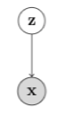


\newcommand{\D}{\mathcal{D}}
\newcommand{\KL}[2]{D_\mathrm{KL}\paren{#1 \mathbin{\|} #2}}
\newcommand{\P}{\mathcal{P}}
\newcommand{\X}{\mathcal{X}}
\newcommand{\Z}{\mathcal{Z}}
\newcommand{\Q}{\mathcal{Q}}
\newcommand{\bx}{\mathbf{x}}
\newcommand{\M}{\mathcal{B}}
\newcommand{\ELBO}{\mathrm{ELBO}}
\newcommand{\bz}{\mathbf{z}}
\newcommand{\giv}{\mid}
\newcommand{\paren}[1]{\left(#1\right)}
\newcommand{\brac}[1]{\left[#1\right]}
\newcommand{\veps}{\varepsilon}
\newcommand{\set}[1]{\left\{#1\right\}}
\renewcommand{\d}{\mathop{}\!\mathrm{d}}
\newcommand{\Expect}{\mathbb{E}}
\newcommand{\Normal}{\mathcal{N}}
\newcommand{\I}{\mathbf{I}}
\newcommand{\0}{\mathbf{0}}
\DeclareMathOperator*{\argmin}{arg\,min}
\DeclareMathOperator*{\argmax}{arg\,max}


Latent variable models form a rich class of probabilistic models that can infer hidden structure in the underlying data. In this post, we will study variational autoencoders, which are a powerful class of deep generative models with latent variables.

Representation
==============

Consider a directed, latent variable model as shown below.

<figure>

<figcaption>
Graphical model for a directed, latent variable model.
 </figcaption>
</figure>

In the model above, $$\bz$$ and $$\bx$$ denote the latent and observed variables respectively. The joint distribution expressed by this model is given as

p_\theta(\bx, \bz) = p(\bx \giv \bz)p(\bz).


From a generative modeling perspective, this model describes a generative process for the observed data $$\bx$$ using the following procedure

\begin{align}
\bz &\sim p(\bz) \\
\bx &\sim p(\bx \giv \bz).
\end{align}


If one adopts the belief that the latent variables $$\bz$$ somehow encode semantically meaningful information about $$\bx$$, it is natural to view this generative process as first generating the "high-level" semantic information about $$\bx$$ first before fully generating $$\bx$$. Such a perspective motivates generative models with rich latent variable structures such as hierarchical generative models $$p(\bx, \bz_1, \ldots, \bz_m) = p(\bx \giv \bz_1)\prod_i p(\bz_i \giv \bz_{i+1})$$---where information about $$\bx$$ is generated hierarchically---and temporal models such as the Hidden Markov Model---where temporally-related high-level information is generated first before constructing $$\bx$$.

We now consider a family of distributions $$\P_\bz$$ where $$p(\bz) \in \P_\bz$$ describes a probability distribution over $$\bz$$. Next, consider a family of conditional distributions $$\P_{\bx\giv \bz}$$ where $$p_\theta(\bx \giv \bz) \in \P_{\bx\giv \bz}$$ describes a conditional probability distribution over $$\bx$$ given $$\bz$$. Then our hypothesis class of generative models is the set of all possible combinations

\begin{align}
\P_{\bx,\bz} = \set{p(\bx, \bz) \giv p(\bz) \in \P_\bz, p(\bx \giv \bz) \in \P_{\bx\giv\bz}}.
\end{align}

Given a dataset $$\D = \set{\bx^{(1)}, \ldots, \bx^{(n)}}$$, we are interested in the following learning and inference tasks
- Selecting $$p \in \P_{\bx,\bz}$$ that "best" fits $$\D$$.
- Given a sample $$\bx$$ and a model $$p \in \P_{\bx,\bz}$$, what is the posterior distribution over the latent variables $$\bz$$?
<!-- - Approximate marginal inference of $$\bx$$: given partial access to certain dimensions of the vector $$\bx$$, how do we impute the missing parts? -->

<!-- We shall also assume the following
- Intractability: computing the posterior probability $$p(\bz \giv \bx)$$ is intractable.
- Big data: the dataset $$\D$$ is too large to fit in memory; we can only work with small, sub-sampled batches of $$\D$$. -->

Learning Directed Latent Variable Models
==============

One way to measure how closely $$p(\bx, \bz)$$ fits the observed dataset $$\D$$ is to measure the Kullback-Leibler (KL) divergence between the data distribution (which we denote as $$p_{\mathrm{data}}(\bx)$$) and the model's marginal distribution $$p(\bx) = \int p(\bx, \bz) \d \bz$$. The distribution that ``best'' fits the data is thus obtained by minimizing the KL divergence. 


\begin{align}
\min_{p \in \P_{\bx, \bz}}\KL{p_{\mathrm{data}}(\bx)}{p(\bx)}.
\end{align}


As we have seen previously, optimizing an empirical estimate of the KL divergence is equivalent to maximizing the marginal log-likelihood $$\log p(\bx)$$ over $$\D$$

\begin{align}
\max_{p \in \P_{\bx, \bz}} \sum_{\bx \in \D} \log p(\bx) = \sum_{\bx \in \D} \log\int p(\bx, \bz) \d \bz.
\end{align}


However, it turns out this problem is generally intractable for high-dimensional $$\bz$$ as it involves an integration (or sums in the case $$\bz$$ is discrete) over all the possible latent sources of variation $$\bz$$. One option is to estimate the objective via Monte Carlo. For any given datapoint $$\bf x$$, we can obtain the following estimate for its marginal log-likelihood


\log p(\bx) \approx \log \frac{1}{k} \sum_{i=1}^k p(\bx \vert \bz^{(i)}) \text{, where } \bz^{(i)} \sim p(\bz)


In practice however, optimizing the above estimate suffers from high variance in gradient estimates. 

Rather than maximizing the log-likelihood directly, an alternate is to instead construct a lower bound that is more amenable to optimization. To do so, we note that evaluating the marginal likelihood $$p(\bx)$$ is at least as difficult as as evaluating the posterior $$p(\bz \mid \bx)$$ for any latent vector $$\bz$$ since by definition $$p(\bz \mid \bx) = p(\bx, \bz) / p(\bx)$$. 

Next, we introduce a variational family $$\Q$$ of distributions that approximate the true, but intractable posterior $$p(\bz \mid \bx)$$. Further henceforth, we will assume a parameteric setting where any distribution in the model family $$\P_{\bx, \bz}$$ is specified via a set of parameters $$\theta \in \Theta$$ and distributions in the variational family $$\Q$$ are specified via a set of parameters $$\lambda \in \Lambda$$. 

Given $$\P_{\bx, \bz}$$ and $$\Q$$, we note that the following relationships hold true[^1] for any $$\bx$$ and all variational distributions $$q_\lambda(\bz) \in \Q$$


\begin{align}
\log p_\theta(\bx) &= \log \int p_\theta(\bx, \bz) \d \bz \\
&= \log \int \frac{q_\lambda(\bz)}{q_\lambda(\bz)} p(\bx, \bz) \d \bz\\
&\ge\int q_\lambda(\bz) \log \frac{p_\theta(\bx, \bz)}{q_\lambda(\bz)} \d \bz \\
&= \Expect_{q_\lambda(\bz)} \left[\log \frac{p_\theta(\bx, \bz)}{q_\lambda(\bz)}\right] \\
&:=\ELBO(\bx; \theta, \lambda)
\end{align}

where we have used Jensen's inequality in the final step. The Evidence Lower Bound or ELBO in short admits a tractable unbiased Monte Carlo estimator

\begin{align}
\frac{1}{k} \sum_{i=1}^k \log \frac{p_\theta(\bx, \bz^{(i)})}{q_\lambda(\bz^{(i)})} \text{, where } \bz^{(i)} \sim q_\lambda(\bz),
\end{align}

so long as it is easy to sample from and evaluate densities for $$q_\lambda(\bz)$$. 

Which variational distribution should we pick? Even though the above derivation holds for any choice of variational parameters $$\lambda$$, the tightness of the lower bound depends on the specific choice of $$q$$. 

<figure>

<figcaption>
Illustration for the KL divergence gap between the marginal log-likelihood \(\log p_\theta(\bx)\) for a point \(\bx\) and the corresponding ELBO for a single 1D-parameter variational distribution \(q_\lambda(\bx)\).
 </figcaption>
</figure>

In particular, the gap between the original objective(marginal log-likelihood $$\log p_\theta(\bx) $$) and the ELBO equals the KL divergence between the approximate posterior $$q(\bz)$$ and the true posterior $$p(\bz \giv \bx)$$. The gap is zero when the variational distribution $$q_\lambda(\bz)$$ exactly matches $$p_\theta(\bz \giv \bx)$$. 

In summary, we can learn a latent variable model by maximizing the ELBO with respect to both the model parameters $$\theta$$ and the variational parameters $$\lambda$$ for any given datapoint $$\bx$$

\begin{align}
\max_{\theta} \sum_{\bx \in \D} \max_{\lambda} \Expect_{q_\lambda(\bz)} \left[\log \frac{p_\theta(\bx, \bz)}{q_\lambda(\bz)}\right].
\end{align}


Black-Box Variational Inference
==============

In this post, we shall focus on first-order stochastic gradient methods for optimizing the ELBO. These optimization techniques are desirable in that they allow us to sub-sample the dataset during optimization---but require our objective function to be differentiable with respect to the optimization variables. 
<!-- As such, we shall posit for now that any $$p(\bx, \bz) \in \P_{\bx, \bz}$$ and $$q(\bz) \in \Q$$ are alternatively parameterizable as $$p_\theta(\bx, \bz)$$ and $$q_\lambda(\bz)$$ and that these distributions are differentiable with respect to $$\theta$$ and $$\lambda$$. -->
This inspires Black-Box Variational Inference (BBVI), a general-purpose Expectation-Maximization-like algorithm for variational learning of latent variable models, where, for each mini-batch $$\M = \set{\bx^{(1)}, \ldots, \bx^{(m)}}$$, the following two steps are performed.

**Step 1**

We first do *per-sample* optimization of $$q$$ by iteratively applying the update

\begin{align}
\lambda^{(i)} \gets \lambda^{(i)} + \tilde{\nabla}_\lambda \ELBO(\bx^{(i)}; \theta, \lambda^{(i)}),
\end{align}

where $$\text{ELBO}(\bx; \theta, \lambda) = \Expect_{q_\lambda(\bz)} \left[\log \frac{p_\theta(\bx, \bz)}{q_\lambda(\bz)}\right]$$, and $$\tilde{\nabla}_\lambda$$ denotes an unbiased estimate of the ELBO gradient. This step seeks to approximate the log-likelihood $$\log p_\theta(\bx^{(i)})$$.

**Step 2**

We then perform a single update step based on the mini-batch

\begin{align}
\theta \gets \theta + \tilde{\nabla}_\theta \sum_{i} \ELBO(\bx^{(i)}; \theta, \lambda^{(i)}),
\end{align}

which corresponds to the step that hopefully moves $$p_\theta$$ closer to $$p_{\mathrm{data}}$$.

Gradient Estimation
==============

The gradients $$\nabla_\lambda \ELBO$$ and $$\nabla_\theta \ELBO$$ can be estimated via Monte Carlo sampling. While it is straightforward to construct an unbiased estimate of $$\nabla_\theta \ELBO$$ by simply pushing $$\nabla_\theta$$ through the expectation operator, the same cannot be said for $$\nabla_\lambda$$. Instead, we see that

\begin{align}
\nabla_\lambda \Expect_{q_\lambda(\bz)} \left[\log \frac{p_\theta(\bx, \bz)}{q_\lambda(\bz)} \right]= \Expect_{q_\lambda(\bz)} \brac{\paren{\log \frac{p_\theta(\bx, \bz)}{q_\lambda(\bz)}} \cdot \nabla_\lambda \log q_\lambda(\bz)}.
\end{align}

This equality follows from the log-derivative trick (also commonly referred to as the REINFORCE trick). The full derivation involves some simple algebraic manipulations and is left as an exercise for the reader. The gradient estimator $$\tilde{\nabla}_\lambda \ELBO$$ is thus

\begin{align}
\frac{1}{k}\sum_{i=1}^k \brac{\paren{\log \frac{p_\theta(\bx, \bz^{(i)})}{q_\lambda(\bz^{(i)})}} \cdot \nabla_\lambda \log q_\lambda(\bz^{(i)})} \text{, where } \bz^{(i)} \sim q_\lambda(\bz).
\end{align}

However, it is often noted that this estimator suffers from high variance. One of the key contributions of the variational autoencoder paper is the reparameterization trick, which introduces a fixed, auxiliary distribution $$p(\veps)$$ and a differentiable function $$T(\veps; \lambda)$$ such that the procedure

\begin{align}
\veps &\sim p(\veps)\\
\bz &\gets T(\veps; \lambda),
\end{align}

is equivalent to sampling from $$q_\lambda(\bz)$$. By the [Law of the Unconscious Statistician](https://en.wikipedia.org/wiki/Law_of_the_unconscious_statistician), we can see that

\begin{align}
\nabla_\lambda \Expect_{q_\lambda(\bz)} \left[\log \frac{p_\theta(\bx, \bz)}{q_\lambda(\bz)}\right] = \Expect_{p(\veps)} \left[\nabla_\lambda \log \frac{p_\theta(\bx, T(\veps; \lambda))}{q_\lambda(T(\veps; \lambda))}\right].
\end{align}

In contrast to the REINFORCE trick, the reparameterization trick is often noted empirically to have lower variance and thus results in more stable training. 
<!-- \rs{I think there exists pathological examples where REINFORCE has lower variance than reparamterization. Should we talk about that?} -->

Parameterizing Distributions via Deep Neural Networks
============== 

So far, we have described $$p_\theta(\bx, \bz)$$ and $$q_\lambda(\bz)$$ in the abstract. To instantiate these objects, we consider choices of parametric distributions for $$p_\theta(\bz)$$, $$p_\theta(\bx \giv \bz)$$, and $$q_\lambda(\bz)$$. A popular choice for $$p_\theta(\bz)$$ is the unit Gaussian

\begin{align}
p_\theta(\bz) = \Normal(\bz \giv \0, \I).
\end{align}

in which case $$\theta$$ is simply the empty set since the prior is a fixed distribution. Another alternative often used in practice is a mixture of Gaussians with trainable mean and covariance parameters. 

The conditional distribution $$p_\theta(\bx \giv \bz)$$ is where we introduce a deep neural network. We note that a conditional distribution can be constructed by defining a distribution family (parameterized by $$\omega \in \Omega$$) in the target space $$\bx$$ (i.e. $$p_\omega(\bx)$$ defines an unconditional distribution over $$\bx$$) and a mapping function $$g_\theta: \Z \to \Omega$$. 
<!-- It is natural to call $$g_\theta$$ the decoder that is parameterized by $$\theta$$. The act of conditioning on $$\bz$$ is thus equivalent to using the choice of $$\omega = g(\bz)$$. --> 
In other words, $$g_\theta(\cdot)$$ defines the conditional distribution

\begin{align}
    p_\theta(\bx \giv \bz) = p_\omega(\bx) \text{ , where } \omega = g_\theta(\bz).
\end{align}

The function $$g_\theta$$ is also referred to as the decoding distribution since it maps a latent *code* $$\bz$$ to the parameters of a distribution over observed variables $$\bx$$. In practice, it is typical to specify $$g_\theta$$ as a deep neural network.  
<!-- The generative model $$p_\theta(\bx, \bz)$$ is called a *deep* generative model since we will be using a neural network to instantiate the function $$g_\theta$$.  -->
In the case where $$p_\theta(\bx \giv \bz)$$ is a Gaussian distribution, we can thus represent it as

\begin{align}
    p_\theta(\bx \giv \bz) = \Normal(\bx \giv \mu_\theta(\bz), \Sigma_\theta(\bz)),
\end{align}

where $$\mu_\theta(\bz)$$ and $$\Sigma_\theta(\bz)$$ are neural networks that specify the mean and covariance matrix for the Gaussian distribution over $$\bx$$ when conditioned on $$\bz$$.

Finally, the variational family for the proposal distribution $$q_\lambda(\bz)$$ needs to be chosen judiciously so that the reparameterization trick is possible. Many continuous distributions in the [location-scale family](https://en.wikipedia.org/wiki/Location%E2%80%93scale_family) can be reparameterized. In practice, a popular choice is again the Gaussian distribution, where

\begin{align}
    \lambda &= (\mu, \Sigma) \\
    q_\lambda(\bz) &= \Normal(\bz \giv \mu, \Sigma)\\
    p(\veps) &= \Normal(\veps \giv \0, \I) \\
    T(\veps; \lambda) &= \mu + \Sigma^{1/2}\veps,
\end{align}

where $$\Sigma^{1/2}$$ is the Cholesky decomposition of $$\Sigma$$. For simplicity, practitioners often restrict $$\Sigma$$ to be a diagonal matrix (which restricts the distribution family to that of factorized Gaussians).

Amortized Variational Inference
==============

A noticeable limitation of black-box variational inference is that **Step 1** executes an optimization subroutine that is computationally expensive. Recall that the goal of the **Step 1** is to find

\begin{align}
    \lambda^* = \argmax_{\lambda\in \Lambda} \ELBO(\bx; \theta, \lambda).
\end{align}

For a given choice of $$\theta$$, there is a well-defined mapping from $$\bx \mapsto \lambda^\ast$$. A key realization is that this mapping can be *learned*. In particular, one can train an encoding function (parameterized by $$\phi$$) $$f_\phi: \X \to \Lambda$$ 
(where $$\Lambda$$ is the space of $$\lambda$$ parameters) 
on the following objective

\begin{align}
    \max_{\phi } \sum_{\bx \in \D} \ELBO(\bx; \theta, f_\phi(\bx)).
\end{align}

It is worth noting at this point that $$f_\phi(\bx)$$ can be interpreted as defining the conditional distribution $$q_\phi(\bz \giv \bx)$$. With a slight abuse of notation, we define

\begin{align}
    \ELBO(\bx; \theta, \phi) = \Expect_{q_\phi(\bz \mid \bx)} \left[\log \frac{p_\theta(\bx, \bz)}{q_\phi(\bz \giv \bx)}\right].
\end{align}

and rewrite the optimization problem as 

\begin{align}
    \max_{\phi } \sum_{\bx \in \D} \ELBO(\bx; \theta, \phi).
\end{align}

It is also worth noting that optimizing $$\phi$$ over the entire dataset as a *subroutine* every time we sample a new mini-batch is clearly not reasonable. However, if we believe that $$f_\phi$$ is capable of quickly adapting to a close-enough approximation of $$\lambda^\ast$$ given the current choice of $$\theta$$, then we can interleave the optimization $$\phi$$ and $$\theta$$. This yields the following procedure, where for each mini-batch $$\M = \set{\bx^{(1)}, \ldots, \bx^{(m)}}$$, we perform the following two updates jointly

\begin{align}
    \phi &\gets \phi + \tilde{\nabla}_\phi \sum_{\bx \in \M} \ELBO(\bx; \theta, \phi) \\
    \theta &\gets \theta + \tilde{\nabla}_\theta \sum_{\bx \in \M} \ELBO(\bx; \theta, \phi),
\end{align}

rather than running BBVI's **Step 1** as a subroutine. By leveraging the learnability of $$\bx \mapsto \lambda^\ast$$, this optimization procedure amortizes the cost of variational inference. If one further chooses to define $$f_\phi$$ as a neural network, the result is the variational autoencoder.

Footnotes
==============
[^1]: The first equality only holds if the support of $$q$$ includes that of $$p$$. If not, it is an inequality.
